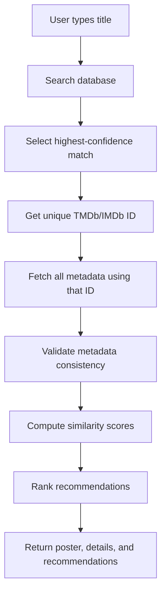

# CineVerse AI - Core Architecture

The core recommendation engine follows a highly optimized, state-of-the-art pipeline to ensure 100% accurate, culturally relevant, and semantically deep movie and TV show recommendations.

## The Recommendation Pipeline

### 1. Data Retrieval
When the user submits a query, the backend instantly hits the TMDb `/search/multi` endpoint to identify the exact unique TMDb ID for the highest-confidence match. Using this ID, the engine pulls massive amounts of metadata, including overviews, cast, genres, ratings, and raw candidate recommendations.

### 2. Semantic Analysis & Validation
The raw candidates are combined into a massive candidate pool. The data is validated for consistency (dropping missing posters/IDs). 

### 3. LLM AI Reranking (Similarity Computation)
The candidate pool is sent to a powerful LLM via the Groq API. The AI acts as a master film critic, computing similarity scores based on:
- Plot and Story Arc
- Emotional Depth
- Pacing and Tone
- Thematic Resonance

If the initial candidate pool is weak, the LLM hallucinates and injects its own superior recommendations from its cinematic memory, and the backend dynamically fetches those missing IDs on the fly!

### 4. Final Rendering
The top 10 absolute best matches are ranked and returned to the Next.js frontend, seamlessly rendering beautiful movie posters, ratings, and bite-sized AI summaries in a flawless, glassmorphism UI.
